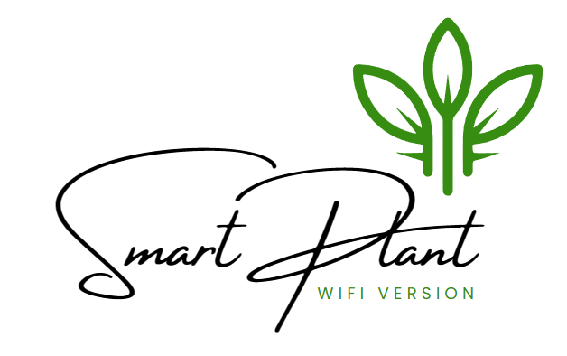
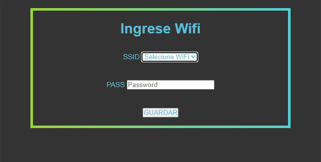
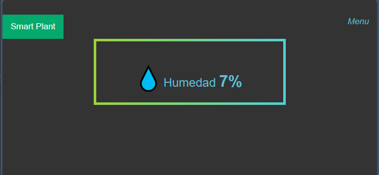
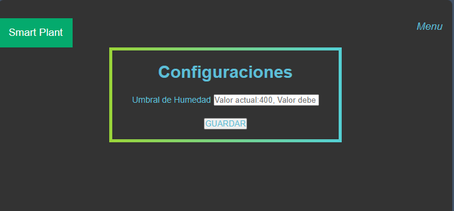

# Control de Bomba de Agua con ESP32 y Sensor de Humedad

## Descripción

Este proyecto utiliza un ESP32 junto con un sensor de humedad para controlar una bomba de agua de manera inteligente. Una de las características destacadas es la capacidad de configurar dinámicamente el umbral de humedad a través de una interfaz web alojada en el propio ESP32. Esto elimina la necesidad de hardcodear valores y permite ajustar el umbral según los requisitos específicos en cualquier momento.

Además, al iniciar, el ESP32 verifica si tiene almacenados en su memoria EEPROM las credenciales de WiFi. Si no las encuentra, se inicia en modo AP, generando una interfaz web para seleccionar una red WiFi y proporcionar la contraseña. Estas credenciales se almacenan en la EEPROM para futuros reinicios, ofreciendo una configuración fácil y rápida.

## Características

- **Configuración Dinámica del Umbral:**
  - Ajusta el umbral de humedad desde la interfaz web del ESP32.
- **Almacenamiento en EEPROM:**
  - Guarda configuraciones importantes, como el umbral de humedad, WiFi y contraseña, en la memoria EEPROM para persistencia entre reinicios.
- **Configuración de WiFi sin Codificación:**
  - Inicia en modo AP si no hay credenciales WiFi almacenadas, permitiendo la configuración fácil a través de una interfaz web generada dinámicamente.

## Diagrama de Conexión

## Instrucciones de Uso

1. Carga el código en tu ESP32 utilizando el IDE de Arduino.
2. Conéctalo a la bomba de agua y al sensor de humedad según el diagrama de conexión.
3. Enciende el ESP32 y espera a que inicie en modo AP si no tiene credenciales WiFi almacenadas.
4. Conéctate a la red WiFi generada por el ESP32.
5. Accede a la interfaz web desde tu navegador para configurar la red WiFi y ajustar el umbral de humedad.

## Capturas de Pantalla

## Contribuciones

¡Las contribuciones son bienvenidas! Si encuentras algún problema o tienes mejoras que sugerir, por favor, abre un problema o una solicitud de extracción.

## Licencia

Este proyecto está bajo la Licencia [MIT](url_de_licencia). Consulta el archivo `LICENSE` para obtener más detalles.